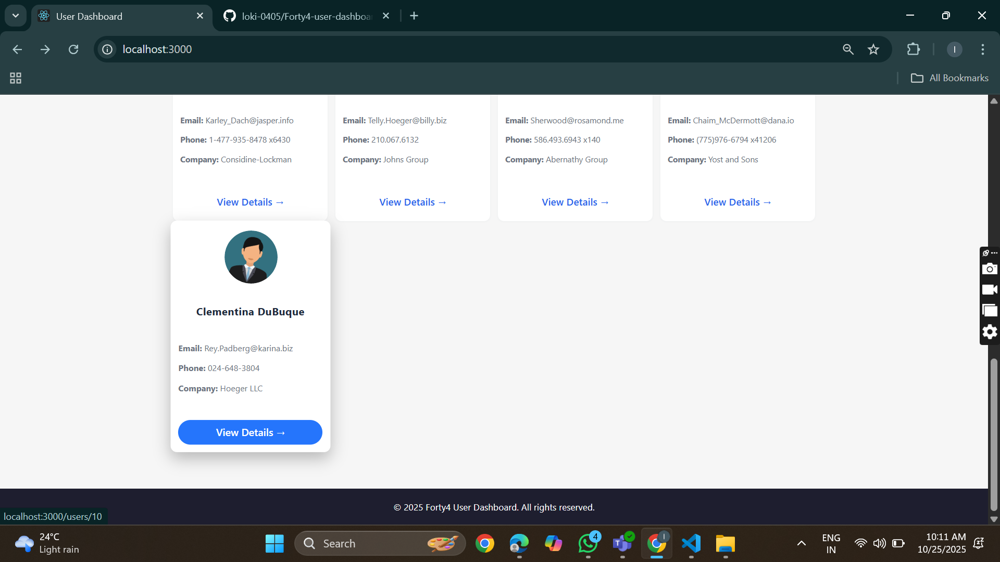

# User Dashboard - React App

A responsive and interactive User Dashboard built with React.js.  
It allows you to view, search, and add users dynamically, with detailed user profiles including address, company info, and geo-location.

---

## Features

- Display a list of users with interactive, colored cards.

- Search users by name using a responsive search bar.

- View detailed user information including:
  - Name, username, email, phone, and website.
  - Company name and details.
  - Full address and geo-location preview.

- Add new users dynamically using a form.

- Interactive and responsive design:
  - Hover effects on user cards and buttons.
  - Sticky header with gradient background.

- Fully responsive layout suitable for desktop and mobile.

---

## Screenshots

**Dashboard Page**  


**User-form-1**  


**user-form-2(Full)**  
.png)

**UserDetails Page**  


**Footer section**  


---

## Installation

1. Clone the repository:

```bash
git clone https://github.com/your-username/forty4-user-dashboard.git
cd forty4-user-dashboard
